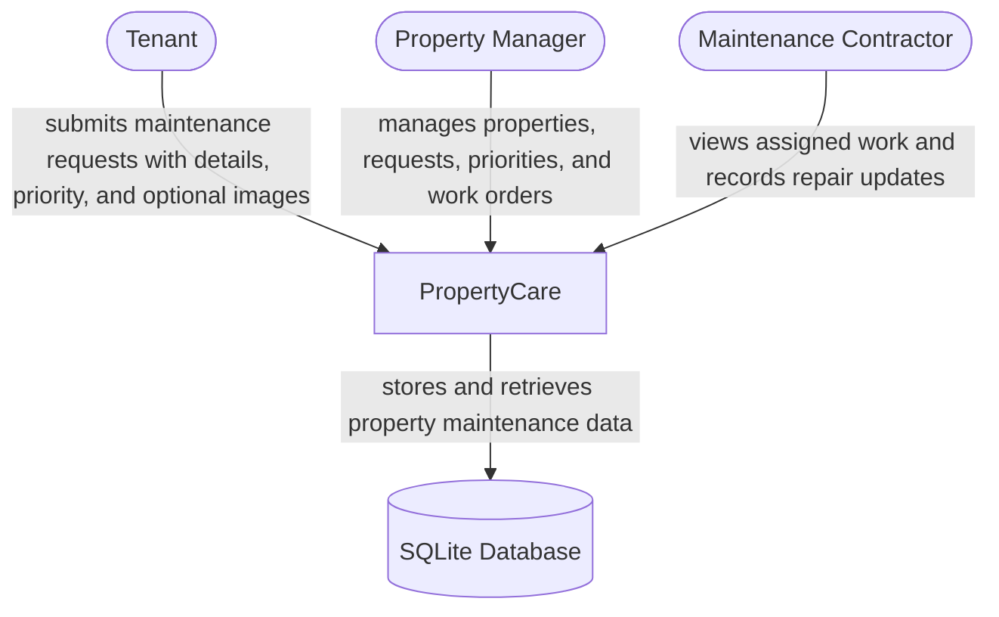
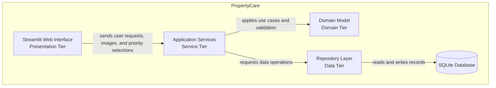
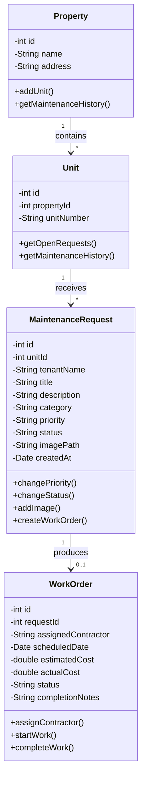
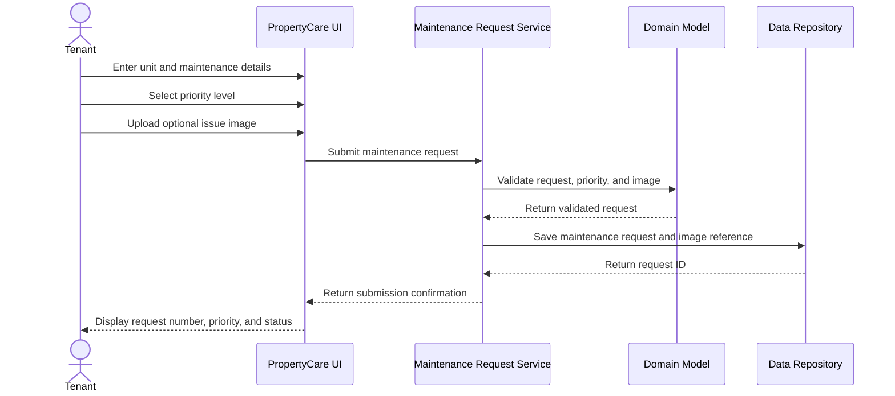

# PropertyCare

<!-- CI badge: after Session 4, replace ORG/REPO and the workflow filename, then uncomment:

-->

**Student:** Jai LNU · **Course:** CEN 5064 Software Design, Fall 2026 · **Partner:** GoldLion72

## Project (approval paragraph — write this by Sun Aug 30)

PropertyCare is a rental maintenance and work-order management system designed for small landlords, property managers, tenants, and maintenance contractors. The system will allow property managers to register properties and rental units, tenants to submit maintenance requests with an optional image of the issue and select a priority level of Low, Medium, High, or Critical, managers to review and prioritize requests and assign repair work, and maintenance contractors to update the progress and completion details of assigned work orders. The system will also keep a maintenance history and track estimated and actual repair costs for each property and unit. PropertyCare will use a layered architecture, a SQLite relational database, and a simple Streamlit web interface so that the project remains manageable and achievable within one semester.

## How to run

```text
PropertyCare is currently in the design and initial development stage.

The planned application will use Python, Streamlit, and SQLite.

When the first working version is implemented, the exact commands needed
to install the dependencies, initialize the database, and run the
application will be added here and tested from a clean clone.
```

## Architecture

### Tier breakdown (Session 2 studio)

| Tier | Responsibilities in THIS system |
|------|--------------------------------|
| Presentation | Displays the tenant maintenance-request form, including issue details, image upload, and priority selection, along with the property-manager dashboard, work-order screens, maintenance history, and repair-cost summaries. It collects user input and displays results without implementing business rules. |
| Service | Coordinates the system's main use cases, including registering properties and units, submitting maintenance requests with optional images and priority levels, reviewing requests, changing request priority, assigning repair work, updating work-order status, and generating maintenance summaries. |
| Domain | Contains the main business entities: Property, Unit, MaintenanceRequest, and WorkOrder. It also contains the business rules for request priority levels, work assignment, repair costs, image information, and valid status changes. |
| Data | Stores and retrieves properties, units, maintenance requests, image references, work orders, and repair-cost information through repository classes using a SQLite relational database. |

### C4 — Context & Container (Session 3 studio)





### UML — Class & Sequence (Session 3 studio)





## Maintenance Request Priority Levels

Each maintenance request will have one of the following priority levels:

| Priority | Description |
|----------|-------------|
| Low | Minor issue that does not require immediate attention. |
| Medium | Normal maintenance issue that should be handled within a reasonable amount of time. |
| High | Important issue that may affect the tenant's ability to use part of the property normally. |
| Critical | Emergency or safety-related issue that requires immediate attention. |

Tenants will be able to select an initial priority while submitting a maintenance request. Property managers will also be able to review and change the priority when necessary.

## Maintenance Request Images

Tenants will have the option to upload an image when submitting a maintenance request. The image can help the property manager and maintenance contractor better understand the reported issue before repair work is assigned.

Uploading an image will be optional so that tenants can still submit a request when an image is not available.

## Architecture Decision Records

Decisions live in [`docs/adr/`](docs/adr/). Start with ADR-001 in Session 4.

| # | Decision | Status |
|---|----------|--------|
| [001](docs/adr/adr-001.md) | Build PropertyCare as a rental maintenance and work-order management system | proposed |

## Weekly log (optional but recommended)

A one-line note per week keeps your commit story readable:

- Week 1 (Aug 24): Repository created, three project ideas drafted, PropertyCare selected, and the approval paragraph added.
- Week 2 (Aug 31): Defined the four-tier architecture and documented the responsibilities of the Presentation, Service, Domain, and Data tiers.
- Week 3 (Sep 7): Created the C4 context and container diagrams, designed the initial UML class diagram, and documented the maintenance-request sequence.
- Week 4 (Sep 14): Expanded the maintenance-request design by adding optional issue-image uploads and four priority levels: Low, Medium, High, and Critical. Updated the architecture, UML model, and request sequence to support the new features.
