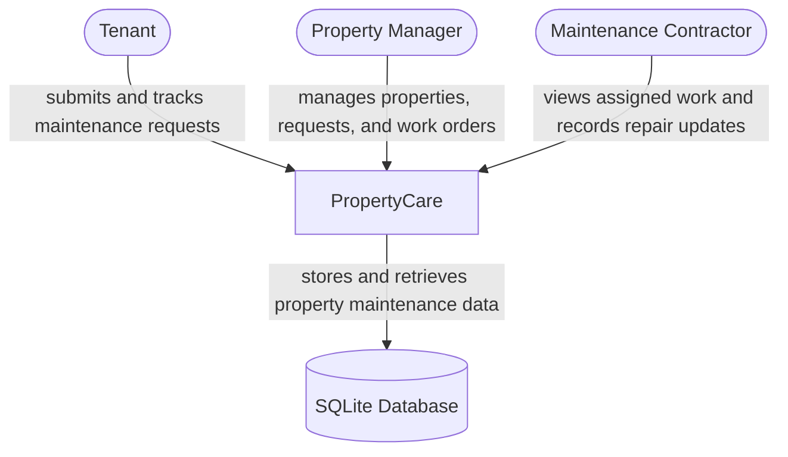
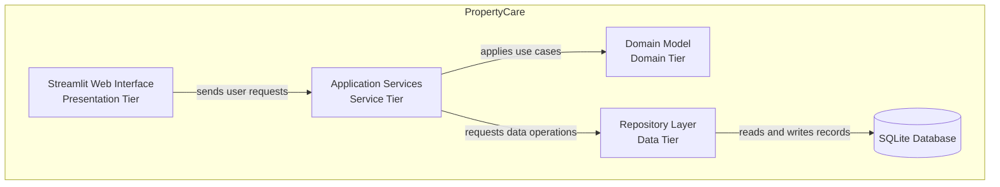
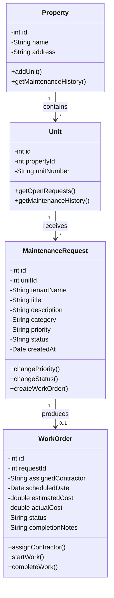
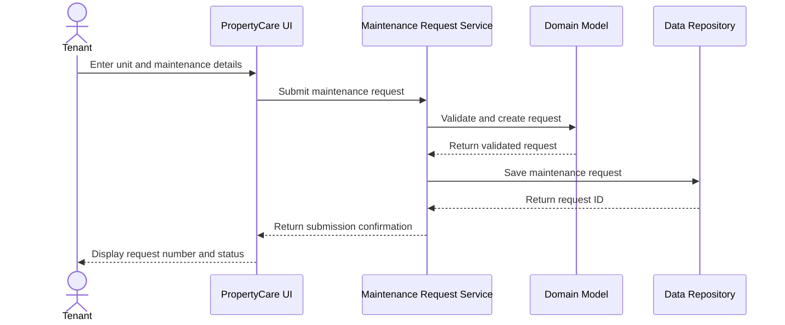

```markdown
# PropertyCare

<!-- CI badge will be added after Session 4 when the GitHub Actions workflow is configured.
-->

**Student:** Jai LNU · **Course:** CEN 5064 Software Design, Fall 2026 · **Partner:** GoldLion72

## Project (approval paragraph — write this by Sun Aug 30)

PropertyCare is a rental maintenance and work-order management system designed for small landlords, property managers, tenants, and maintenance contractors. The system will allow property managers to register properties and rental units, tenants to submit maintenance requests, managers to prioritize requests and assign repair work, and contractors to update the progress and completion details of assigned work orders. It will also maintain repair histories and cost summaries for each property and unit. The application will use a layered architecture, a single relational database, and a simple web-based interface so that it remains achievable within one semester.

## How to run


```

PropertyCare is currently in the design and initial development stage.
Exact installation and execution commands will be added when the first
working version of the application is committed.

```

## Architecture

### Tier breakdown (Session 2 studio)

| Tier | Responsibilities in THIS system |
|------|--------------------------------|
| Presentation | Displays role-based views (Tenant Portal, Property Manager Dashboard, Contractor Hub) and handles UI form validation without executing business logic. |
| Service | Coordinates core use cases and role authorization, managing atomic multi-step operations (such as linking maintenance request updates to work order creation). |
| Domain | Houses entities (`User`, `Tenant`, `PropertyManager`, `Contractor`, `Property`, `Unit`, `MaintenanceRequest`, `WorkOrder`) and enforces business rules for priorities, cost tracking, and state-machine status lifecycle transitions. |
| Data | Manages database persistence using abstract repository interfaces to decouple logic, executing queries and aggregate cost summaries against a SQLite database with migration support. |

### C4 — Context & Container (Session 3 studio)





### UML — Class & Sequence (Session 3 studio)





## Architecture Decision Records

Decisions live in [`docs/adr/`](https://www.google.com/search?q=docs/adr/). Start with ADR-001 in Session 4.

| # | Decision | Status |
| --- | --- | --- |
| [001](https://www.google.com/search?q=docs/adr/adr-001.md) | Build PropertyCare as a rental maintenance and work-order management system | proposed |

## Weekly log (optional but recommended)

A one-line note per week keeps your commit story readable:

* Week 1 (Aug 24): Repository created, three project ideas drafted, PropertyCare selected, and the approval paragraph added.
* Week 2 (Aug 31): Defined the four-tier architectural breakdown, layer responsibilities, and system boundary definitions during the Session 2 studio.

```

```
